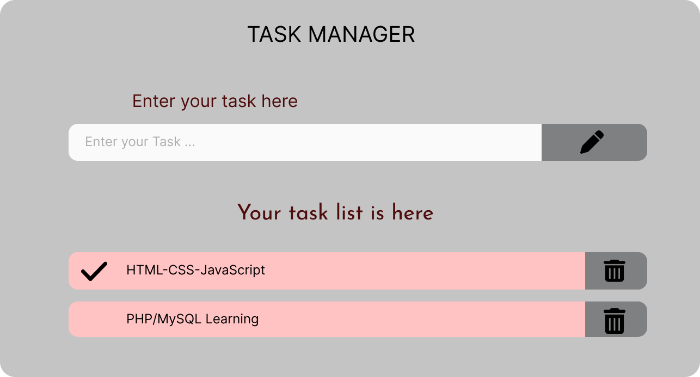

# Task_List
## Preview picture here.

### Just a dinamic task manager page.
##

#
# Colors
### Input/Output Section 
    
    Background: #C4C4C4;
    border-radius: 28px;

### Great title Text
    
    font-weight: 400;
    font-size: 40px;
    line-height: 48px;
    text-align: center;

### Text Input Label

    font-weight: 400;
    font-size: 32px;
    line-height: 39px;
    text-align: center;
    color: #4F0C0C;

### Input

    background: #FAFAFA;
    border-radius: 7px 0px 0px 7px;

### Input Placeholder Text

    font-weight: 400;
    font-size: 24px;
    line-height: 29px;
    color: #AEAEAE;

### Input Button 
    
    background: #7F8082;
    border-radius: 0px 7px 7px 0px;

### User Task list Title

    font-family: 'Josefin Sans';
    font-style: normal;
    font-weight: 400;
    font-size: 40px;
    line-height: 40px;
    text-align: center;
    color: #4F0C0C;

### List text output section

    background: #FFC4C4;
    border-radius: 7px 0px 0px 7px;

### List text output

    font-weight: 400;
    font-size: 24px;
    line-height: 29px;
    color: #000000;

### Delete button

    background: #7F8082;
    border-radius: 0px 7px 7px 0px;
